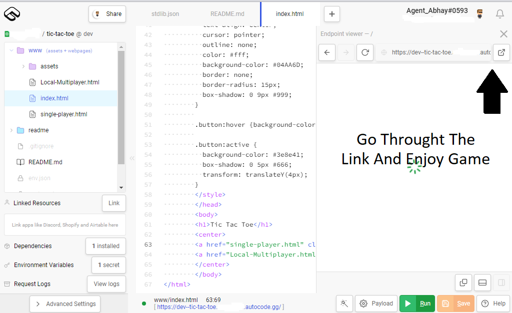

# Tic-Tac-Toe Game

Tic-tac-toe is a game in which two players take turns in drawing either an ' O' or an ' X'
in one square of a grid consisting of nine squares.
The winner is the first player to get three of the same symbols in a row.

## Features

Tic Tac Toe Game is a digital version of a classic two player game.

This free Open Source Tic Tac Toe app On Autocode :
- beautiful design With Background.
- Easy To Install.
- 2 players local multiplayer.
- Single Player Mode.

## How To Install?

<b> 5 Steps To Play Game</b>

<li>Click Above Button To Install</li>

<li>Install The App Then Open Project</li>

<li>Run The Index.html File</li>

Then Go Throught The Link Which Appear At Top Right Of Page

## Preview

 &nbsp;  &nbsp; 

### GAME RULES:
A player can choose between two symbols with his opponent, usual game uses “X” and “O”. 
1.	The player that gets to play first will get the "X" mark (we call him/her player 1) and the player that gets to play second will get the "O" mark (we call him/her player 2).

2.	Player 1 and 2 take turns making moves with Player 1 playing mark “X” and Player 2 playing mark “O”.

3.	A player marks any of the 3x3 squares with his mark (“X” or “O”) and their aim is to create a straight line horizontally, vertically or diagonally with two intensions: 
a.	One of the players gets three of his/her marks in a row (vertically, horizontally, or diagonally) i.e. that player wins the game. 
b.	If no one can create a straight line with their own mark and all the positions on the board are occupied, then the game ends in a  draw/tie.
